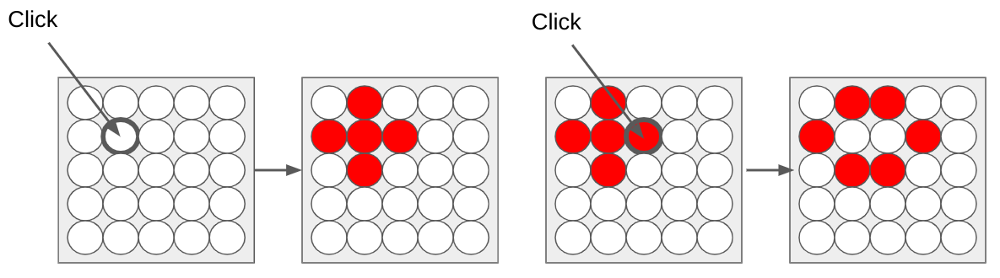

# FLIA

Este repositório é um trabalho da disciplina FLIA, Fundamentos Lógicos da Inteligência Artificial, ministrada pelo professor Bruno Ribas na FGA-UnB.

https://github.com/Luidooo/LightsOut-RGB/assets/130774295/da904536-e363-42f5-aad5-e7ba61fb5b46

Utilizando PDDL (Planning Domain Description Language), resolvemos um jogo clássico chamado LightsOut, que consiste em um jogo onde, ao clicar, o estado de uma célula é alternado entre aceso e apagado, assim como o estado das células adjacentes. Como exemplifica a imagem:




O jogo foi modificado para alterar o estado de todas as lâmpadas da linha e coluna referentes à lâmpada clicada. Temos 4 tipos diferentes de lâmpadas, onde cada uma possui uma dinâmica única de mudança de estado. O objetivo do jogo é deixar todas as lâmpadas brancas, o que equivale a mantê-las apagadas no jogo original. Mais informações podem ser vistas no enunciado do problema:

[Link do Enunciado](https://moj.naquadah.com.br/cgi-bin/score.sh/bcr-FLIA-2024_1-lightsoutrgb)

Para testar, basta clicar no link do enunciado, criar um mapa utilizando o padrão: <tipo da lâmpada> <cor da lâmpada>.

Temos lâmpadas dos seguintes tipos:

- `-` do tipo normal
- `*` quebrado próprio, onde ao clicar não muda-se a cor dele mas muda as linhas e colunas
- `_` quebrado vertical, onde ao clicar muda-se ele e as linhas apenas
- `#` quebrado total, onde ao clicar muda-se linha e coluna, mas se ao chegar nele não muda de estado
- `|` quebrado vertical, onde clicar muda-se ele próprio e suas colunas, apenas 

A sequência de mudança de cor segue o padrão: 
- `White -> Red -> Green -> Blue -> White...` 
Para definir a cor da lâmpada basta escrever sua inicial em maiúsculo. 
- `W`
- `R`
- `G`
- `B`

Exemplo de mapa:
```
*W-R-R-B
-R|W-W-G
-B-G_G-G
-R-W-W#W
```
